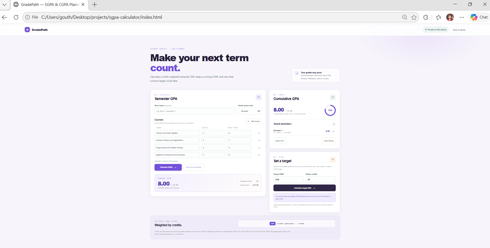

# GradePath — SGPA & CGPA Planner

A responsive, browser-based calculator for semester GPA, cumulative GPA, and future grade-point planning. The project uses plain HTML, CSS, and JavaScript with no framework, runtime dependency, remote font, or external service.

## Preview



The preview shows sample values for demonstration; it is not a real academic record.

## Features

- Calculate SGPA from course credits and grade points using a credit-weighted average.
- Select a 4.0, 5.0, or 10.0 grade-point scale. Enter the grade-point values used by your institution; the calculator does not assume letter-grade conversions.
- Save semester summaries in this browser and calculate cumulative CGPA from their credits and quality points.
- Explore the average grade points needed in future credits to reach a target CGPA, including a clear message when the target is above the selected scale.
- Export saved semester summaries to CSV or remove a saved semester.
- Responsive layout, keyboard-visible focus styles, accessible form labels, and input validation.
- Automated calculation tests and a GitHub Actions workflow.

## Run locally

No package installation is required to use the calculator. Open `index.html` in a modern browser.

Saved semester summaries stay in that browser's local storage. They are not uploaded. Export a CSV to keep a separate copy. Clearing browser storage also removes saved summaries.

## Run the tests

Install Node.js 20 or newer, then from the project folder run:

```bash
node --test
```

If you also have npm installed, `npm test` runs the same command. The tests cover credit-weighted SGPA and CGPA math, scale validation, incomplete rows, and target planning. GitHub Actions runs the tests on pushes and pull requests.

## Calculation method

**SGPA**

```text
sum(course credits × course grade points) / sum(course credits)
```

**CGPA**

```text
sum(saved semester quality points) / sum(saved semester credits)
```

Semester quality points are retained at full numeric precision; the interface rounds displayed values to two decimals. All saved terms must use the same grade-point scale. The future-target planner estimates the average grade points needed over the future credits entered.

## Important notes

- Use the credit values and grade-point conversions from your institution's current academic rules. The available scales do not imply that a particular university uses a specific conversion.
- The future target is a mathematical estimate, not an official result or guarantee.
- This is a student portfolio project. Always use your university's official records for academic decisions.

## Project files

- `index.html` — Calculator interface and page structure.
- `style.css` — Responsive styling.
- `main.js` — Browser interface, local saving, history, and CSV export.
- `gpa-core.js` — Pure calculation and validation logic shared with tests.
- `tests/gpa-core.test.js` — Automated calculation tests.
- `.github/workflows/tests.yml` — Continuous integration workflow.
